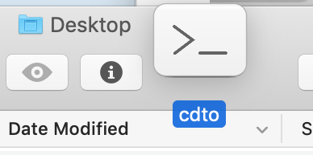
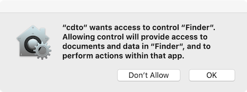

# CDTO


cdto is a Mac-only script used to open a terminal at the current Finder folder.


## Installation
1. Double click ```cdto.scpt``` to open it in Script Editor
1. Go to ```File -> Save as...``` and choose Application as the File Format
1. Open a Finder window. 
1. Hold the <kbd>Command</kbd> key and drag the application you just saved into the toolbar. When you let go it should stay in the toolbar.

    

1. Optionally, change the app icon.
    1. Open ```cdto_elcap+.png``` from this repo in ```Preview```
    1. ```Select All```, ```Copy```
    1. Do a ```Get Info``` on the application in Finder
    1. Select the icon in the top left and ```Paste```

## Usage
Click the app in the toolbar to open a terminal for whichever Finder window is currently active.

## Notes
You may see a dialog like the following on recent versions of macOS. Since you can verify the contents of the script, just click OK to allow it to run.




